# 📊 Diagramas de Flujo del Portal Virtual

Este documento visualiza los flujos de interacción clave del sistema "Portal Virtual Urovital", basados en la arquitectura definida en `context.md` y el plan de `plan-de-desarrollo.md`.

---

## Flujo 1: Agendamiento y Pago de Cita por parte del Paciente

Este diagrama muestra el proceso completo desde que un nuevo paciente se registra hasta que sube su comprobante de pago, dejando su cita lista para ser validada.

```mermaid
sequenceDiagram
    participant Paciente
    participant Frontend React (Portal Paciente)
    participant Backend Spring Boot (hospital_main)
    participant Base de Datos

    Paciente->>Frontend React (Portal Paciente): Accede a la página de registro
    Frontend React (Portal Paciente)->>Backend Spring Boot (hospital_main): POST /api/auth/register (con datos)
    Backend Spring Boot (hospital_main)->>Base de Datos: Crea nuevo User con rol PATIENT
    Backend Spring Boot (hospital_main)-->>Frontend React (Portal Paciente): 201 Created
    Frontend React (Portal Paciente)-->>Paciente: Muestra mensaje de registro exitoso

    Paciente->>Frontend React (Portal Paciente): Inicia sesión con credenciales
    Frontend React (Portal Paciente)->>Backend Spring Boot (hospital_main): POST /api/auth/login
    Backend Spring Boot (hospital_main)-->>Frontend React (Portal Paciente): Devuelve JWT Token
    
    activate Frontend React (Portal Paciente)
    Frontend React (Portal Paciente)->>Backend Spring Boot (hospital_main): GET /api/appointments/me (con JWT)
    Backend Spring Boot (hospital_main)-->>Frontend React (Portal Paciente): Devuelve historial de citas del paciente
    deactivate Frontend React (Portal Paciente)

    Paciente->>Frontend React (Portal Paciente): Solicita agendar nueva cita
    Frontend React (Portal Paciente)->>Backend Spring Boot (hospital_main): GET /api/catalog/specialties
    Frontend React (Portal Paciente)->>Backend Spring Boot (hospital_main): GET /api/catalog/availability?specialtyId=X
    Paciente->>Frontend React (Portal Paciente): Selecciona especialidad, fecha y bloque
    
    activate Backend Spring Boot (hospital_main)
    Frontend React (Portal Paciente)->>Backend Spring Boot (hospital_main): POST /api/appointments (con JWT y datos de la cita)
    Backend Spring Boot (hospital_main)->>Base de Datos: Crea Appointment (paymentStatus=PROCESSING)
    Backend Spring Boot (hospital_main)->>Base de Datos: Crea Payment (status=PROCESSING)
    Base de Datos-->>Backend Spring Boot (hospital_main): Confirma creación
    Backend Spring Boot (hospital_main)-->>Frontend React (Portal Paciente): 201 Created (con ID de la cita)
    deactivate Backend Spring Boot (hospital_main)

    Frontend React (Portal Paciente)-->>Paciente: Muestra confirmación de pre-reserva y solicita subir comprobante
    Paciente->>Frontend React (Portal Paciente): Sube imagen del comprobante de pago
    
    activate Backend Spring Boot (hospital_main)
    Frontend React (Portal Paciente)->>Backend Spring Boot (hospital_main): POST /api/appointments/{id}/receipt (con JWT y archivo)
    Backend Spring Boot (hospital_main)->>Base de Datos: Actualiza Payment con la ruta de la imagen del recibo
    Backend Spring Boot (hospital_main)-->>Frontend React (Portal Paciente): 200 OK
    deactivate Backend Spring Boot (hospital_main)
    Frontend React (Portal Paciente)-->>Paciente: Muestra mensaje "Comprobante subido. Pendiente de validación."

```

---

## Flujo 2: Validación de Pago por parte de la Recepcionista

Este diagrama muestra cómo el personal de recepción utiliza su portal para validar las citas agendadas virtualmente, completando el ciclo.

```mermaid
sequenceDiagram
    participant Recepcionista
    participant Frontend React (hospital_dashboard)
    participant Backend Spring Boot (hospital_main)
    participant Base de Datos

    Recepcionista->>Frontend React (hospital_dashboard): Inicia sesión y accede al módulo "Validación de Citas"
    
    activate Frontend React (hospital_dashboard)
    Frontend React (hospital_dashboard)->>Backend Spring Boot (hospital_main): GET /api/reception/pending-validation (con JWT de recepcionista)
    Backend Spring Boot (hospital_main)->>Base de Datos: Consulta Appointments donde paymentStatus=PROCESSING
    Base de Datos-->>Backend Spring Boot (hospital_main): Devuelve lista de citas
    Backend Spring Boot (hospital_main)-->>Frontend React (hospital_dashboard): Responde con la lista de citas pendientes
    deactivate Frontend React (hospital_dashboard)
    
    Frontend React (hospital_dashboard)-->>Recepcionista: Muestra la lista de citas a validar

    Recepcionista->>Frontend React (hospital_dashboard): Selecciona una cita para revisar
    Frontend React (hospital_dashboard)-->>Recepcionista: Muestra detalles de la cita y la imagen del comprobante

    Recepcionista->>Recepcionista: Verifica el pago en el sistema bancario
    
    alt Pago Correcto
        Recepcionista->>Frontend React (hospital_dashboard): Hace clic en "Validar Pago"
        
        activate Backend Spring Boot (hospital_main)
        Frontend React (hospital_dashboard)->>Backend Spring Boot (hospital_main): POST /api/reception/payments/{id}/validate (con JWT)
        Backend Spring Boot (hospital_main)->>Base de Datos: Actualiza status de Payment a COMPLETED
        Backend Spring Boot (hospital_main)->>Base de Datos: Actualiza paymentStatus de Appointment a COMPLETED
        Base de Datos-->>Backend Spring Boot (hospital_main): Confirma actualización
        Backend Spring Boot (hospital_main)-->>Frontend React (hospital_dashboard): 200 OK
        deactivate Backend Spring Boot (hospital_main)
        
        Frontend React (hospital_dashboard)-->>Recepcionista: Muestra "Cita validada exitosamente" y la elimina de la lista de pendientes
    
    else Pago Incorrecto
        Recepcionista->>Frontend React (hospital_dashboard): Hace clic en "Rechazar Pago"
        
        activate Backend Spring Boot (hospital_main)
        Frontend React (hospital_dashboard)->>Backend Spring Boot (hospital_main): POST /api/reception/payments/{id}/reject (con JWT y motivo)
        Backend Spring Boot (hospital_main)->>Base de Datos: Actualiza status de Payment a FAILED o REQUIRES_CORRECTION
        Backend Spring Boot (hospital_main)-->>Frontend React (hospital_dashboard): 200 OK
        deactivate Backend Spring Boot (hospital_main)

        Frontend React (hospital_dashboard)-->>Recepcionista: Muestra "Validación rechazada"
    end

``` 

